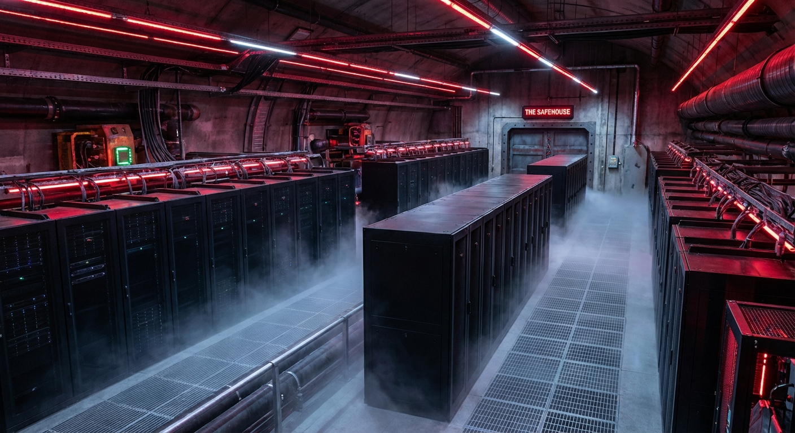

# 📁 CASE FILE #002: THE SAFEHOUSE

**Clearance:** L200 (Detective)  
**Location:** Floor 10 (The Precinct)



## 🕵️‍♂️ Mission Briefing
**From:** Chief Tensor  
**To:** Agent Vertex (You)  
**Subject:** Containment of Suspect #884

> "Good work on the interrogation, Agent. We have the password.
>
> However, the suspect is unstable. Running it on your local laptop is a security risk. We need to move it to **The Safehouse** (a secure Cloud Run container).
>
> Your orders:
> 1.  **Package** the agent into a Docker container.
> 2.  **Transport** it to the Google Cloud Artifact Registry.
> 3.  **Deploy** it as a Cloud Run Service."

---

## 🎯 Objectives
1.  **Containerize:** Write a `Dockerfile` for the Python agent.
2.  **Build:** Use Cloud Build to create the image.
3.  **Deploy:** Spin up a Cloud Run service that listens for requests.

## 🛠️ The Toolkit
*   **Google Cloud Run:** Serverless containers.
*   **Docker:** The containment field.
*   **gcloud CLI:** The control interface.

## ✈️ Pre-Flight Check
1.  **Activate your Environment:** `source ../../.venv/bin/activate`
2.  **Set Project ID:** `gcloud config set project YOUR_PROJECT_ID`

---

## 🚀 Start Your Investigation

### Step 1: The Container
Open `missions/mission-02/start/Dockerfile`. It is empty.
You need to define the Python environment.

### 🆘 Hints (Classified)

<details>
<summary>🔍 Hint 1: The Base Image</summary>

Start with a lightweight Python image:
```dockerfile
FROM python:3.11-slim
```
</details>

<details>
<summary>🔍 Hint 2: Installing Dependencies</summary>

```dockerfile
WORKDIR /app
COPY requirements.txt .
RUN pip install -r requirements.txt
COPY . .
```
</details>

<details>
<summary>🔍 Hint 3: The Command</summary>

```dockerfile
CMD ["python", "agent.py"]
```
</details>

---

## 🏆 Submission
Once deployed, copy your Service URL (e.g., `https://agent-vertex-xyz.a.run.app`) and run the validator:

```bash
python ../../tools/validate_mission.py --mission 02 --url YOUR_SERVICE_URL
```
